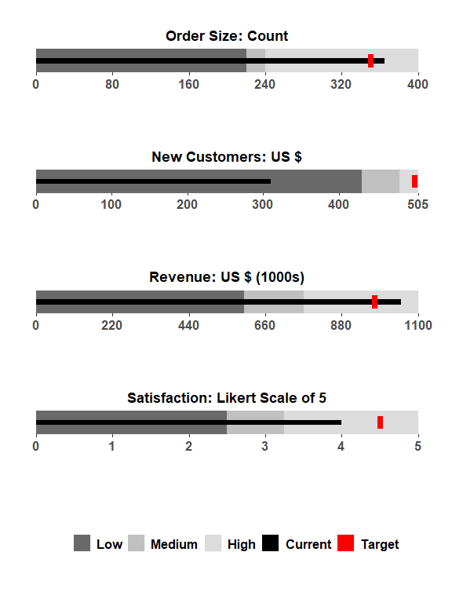
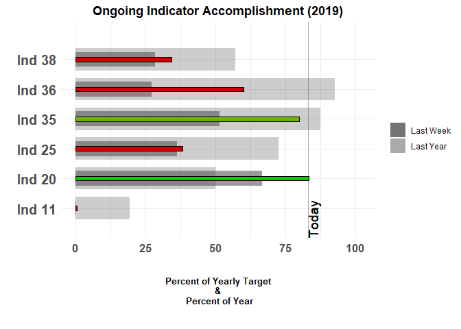
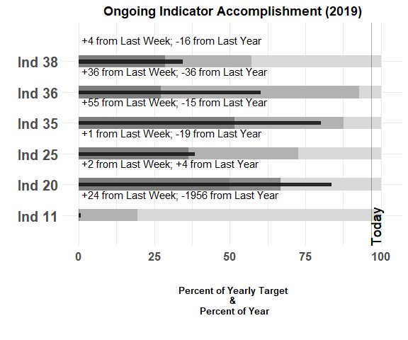

<!-- README.md is generated from README.Rmd. Please edit that file -->

# bulletchartr <a href='https:/acdivocatech.github.io/bulletchartr'></a>

<!-- badges: start -->

[](https://codecov.io/gh/ACDIVOCATech/bulletchartr?branch=master)
[](https://travis-ci.org/ACDIVOCATech/bulletchartr)
[](https://www.tidyverse.org/lifecycle/#experimental)
<!-- badges: end -->

This package, `bulletchartr` is based on visualizing M\&E deliverables
or “Indicators”, however, it can be handy for anyone that depends on
monitoring Key Performance Indicators (KPIs) or needs to track progress
against different targets.

## Installation

``` r
# Install the package from GitHub:
# install.packages("devtools")

devtools::install_github("ACDIVOCATech/bulletchartr")
```

## Introductory Vignettes

  - [Intro to Bullet
    Charts](https://acdivocatech.github.io/bulletchartr/articles/intro-to-bullet-charts.html)
  - [Intro to bulletchartr data
    inputs](https://acdivocatech.github.io/bulletchartr/articles/intro-inputs.html)
  - [Intro to bulletchartr function
    arguments](https://acdivocatech.github.io/bulletchartr/articles/intro-arguments.html)

## Quick Overview

The **bullet chart** was invented by [Stephen
Few](https://www.perceptualedge.com/articles/misc/Bullet_Graph_Design_Spec.pIndicatorData),
for the purpose of showing tons of info in a condensed form in KPIs. It
is basically a variation of a bar chart that allows you to compare one
measure against other metrics such as a target value and/or some
qualitative measures of performance (ex. low - medium - high or poor -
satisfactory - good). These qualitative labels are displayed as varying
intensities of a single color from dark (low/bad/negative) to light
(high/good/positive).

The output of the `bullet_chart()` function most closely resembles
Stephen Few’s design:

``` r
## load example data
load(read_example("bc_ex.rda"))

bullet_chart(dataframe = bc_ex)
```



## Time-comparison bullet charts

The outputs of `bullet_chart_symbols()`, `bullet_chart_wide()`, and
`bullet_chart_vline()` have a different x-axis scale to a regular bullet
chart.

The x-axis represents both the percentage of the yearly target AND the
percentage of the year that has passed. There is a vertical line showing
`TODAY`, which shows at what percentage of the year **and** what
percentage of the target we are at right now. The color inside the bar
is **green** if we are near or past the `TODAY` line, **orange** when
we’re close and **red** when we’re very behind schedule/target. One
of the main differences between this set of functions is how they
present the values for “Last Week” and “Last Year” for each of the
indicators.

``` r
bullet_chart_symbols(file_name = read_example("Indicators_Targets_ext.xlsx"),
                     cal_type = "2019/05/02")
```


``` r
bullet_chart_wide(file_name = read_example("Indicators_Targets_ext.xlsx"),
                  cal_type = "cal")
```



``` r
bullet_chart_vline(file_name = read_example("Indicators_Targets_ext.xlsx"))
```



## Future direction

Currently this package is geared more toward non-R using M\&E people
(therefore, the Excel file input alongside a dataframe input), however
as we develop this package further we want to go towards being able to
make the `bullet_chart` functions more customizable for general use
cases.
