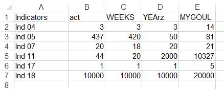

```{r setup, include = FALSE}
knitr::opts_chunk$set(
  collapse = TRUE,
  comment = "#>"
)
```

```{r include=FALSE}
library(readxl)
library(dplyr)
library(lubridate)
library(ggplot2)
library(bulletchartr)

load("data/df.Rda")

```

## What is a bullet chart?

The __bullet chart__ was invented by [Stephen Few](https://www.perceptualedge.com/articles/misc/Bullet_Graph_Design_Spec.pIndicatorData), for the purpose of showing tons of info in a condensed form in KPIs.

This type of graph is a variation on a typical bar graph with a thick line presenting an important point for that indicator (benchmark, performance target, etc.) and other bars in the background that can signify different levels of performance (low-high, bad-good, etc.). The bullet chart makes it very easy to compare between related measures (e.g. present status versus status at similar time in the past).

The output of the `bullet_chart()` function most closely resembles Stephen Few's design: 

```{r, fig.width=6,fig.height=5, echo=TRUE}
bullet_chart(file_name = "data/Indicators_Targets_ext.xlsx")
```

The single black bar represents the current value of the indicator while the different hue columns represent last week's value (darker hue) and last year's value (lighter hue). The bar for each Indicator show the progression along the horizontal-axis presenting the percentage of the yearly target completed. This axis also shows the percent of the year gone by with the vertical line indicating what exact percentage "Today" is, along this percentage. 

As you can see, the bars show the progression along the horizontal-axis presenting the percentage of the yearly target completed. Also, along this axis is the percent of the year gone by with a vertical line indicating what exact percentage __"Today"__ is along this percentage. It is necessary to use percentages as we have multiple indicators of varying units/parameters for each project! 

The different grey colored bars represent the values of the indicator at "Last Week" and "Last Year". The grey scaled bars can represent any qualitative ranges such as "bad - good - excellent" or ____ . In the near future we will look to expand the capabilities of this package to allow users to specify these qualitative ranges to fit their needs. 

This package, `bulletchartr` is based on visualizing M&E deliverables or "Indicators", however, it can be handy for anyone that depends on monitoring Key Performance Indicators (KPIs) or needs to track progress against different targets. 

## Installation

```{r, eval = FALSE}
# Install the package from GitHub:
# install.packages("devtools")

devtools::install_github("ACDIVOCATech/bulletchartr")

```

## Dataframe or Excel input

To use the functions included in this package, one can provide either a dataframe or Excel (.xlsx) file as the input. Either file input needs to contain columns with names that correspond to the following: `indicator_name`, `actual`, `actual_lastweek`, `actual_lastyear`, and `target`.

```{r, fig.width=6,fig.height=5, eval=FALSE}

bullet_chart(dataframe = df)

bullet_chart(file_name = "data/Indicators_Targets.xlsx")

```

See below for an example of what this might look like (in an Excel sheet): 

<!-- -->

The following sections will describe these variables, as well as the extra variables calculated within the function in more detail. In later versions we hope to streamline this process to make it easier to use. 

* `indicator_name`: the name of the indicator or KPI that you are measuring
* `actual`: the value of the indicator at the current time of viewing ("Today")
* `actual_lastweek`: Last week's value of the indicator
* `actual_lastyear`: Last year's value of the indicator
* `target`: the target value for the indicator (used to calculate the percent variables)

With some tidy eval magic you can provide an input (Excel or dataframe) with different column names as long as you specify which corresponds to the column names listed above. For example, with an Excel sheet with these column names:

<!-- -->

As you can see we have some names like "WEEKS" or "YEArz". We can specify what each of these names correspond to inside the function call and we can still get a proper chart!

```{r}

bullet_chart(file_name = "data/test.xlsx",
             indicator_name = "Indicators",
             actual = "act",
             actual_lastweek = "WEEKS",
             actual_lastyear = "YEArz",
             target = "MYGOUL")

```

Now let's move on to the variables that are calculated internally by the function!

The percentages along the horizontal axis are calculated by: 

* `Perc`: Value of indicator as percent of yearly target and percent of the year at the current time
* `PercWeek`: Last week's value of the indicator as percent of yearly target and percent of the year
* `PercYear`: Last year's value of the indicator as percent of yearly target and percent of the year

`BehindBy` is calculated by: `Perc - PercentTime` and shows how far behind the current value of the indicator is to the target value for the current time and shows up as the text above each bar: 

* "OK!": Shows that the current value of the indicator meets the target value for the current time
* "Need ___ more": Shows exactly how much more of the indicator is needed to reach the target value for the current time


## bullet_chart() functions!

Along with the `bullet_chart()` function that you saw above we also have `bullet_chart_wide()`.
This is similar to the standard bullet chart but uses different thicknesses for the bars as the benchmarks for previous time points (last week and last year) to further
accentuate the difference graphically.

```{r, fig.width=6, fig.height=5, echo=TRUE}
bullet_chart_wide(file_name = "data/Indicators_Targets_full.xlsx")
```


`bullet_chart_symbols()` shows a version with different symbols representing the indicator value for 
last week (diamond) and last year (circle).

```{r,fig.width=6,fig.height=5, echo=TRUE}
bullet_chart_symbols(file_name = "data/Indicators_Targets_full.xlsx")
```


`bullet_chart_vline()` provides a version with a single colored bar representing the current value
for the indicator along with a black vertical line representing the indicator value at this time
last year.

```{r,fig.width=6,fig.height=5, echo=TRUE}
bullet_chart_vline(file_name = "data/Indicators_Targets_full.xlsx")

```

## Different calendars

The vertical line showing `Today` can be customized depending on whether you are measuring by a fiscal year, a calendar year, or a custom date. `Today` shown on a Fiscal Year calendar (considering that today's physical date is `r Sys.Date()`.) is show below:

```{r,fig.width=6,fig.height=5, echo=TRUE}
bullet_chart_symbols(file_name = "data/Indicators_Targets_full.xlsx", cal_type = "fis")
```

or for a calendar year:

```{r,fig.width=6,fig.height=5, echo=TRUE}
bullet_chart_symbols(file_name = "data/Indicators_Targets_ext.xlsx", cal_type = "cal")
```

or using a custom date that you can feed directly into the plotting function:

```{r,fig.width=6,fig.height=5, echo=TRUE}
bullet_chart_symbols(file_name = "data/Indicators_Targets_ext.xlsx", cal_type = "2018/02/15")
```

By doing this the function will automatically calculate your progress and targets according to the calendar type that you specified.

## `small` version

If you want to see a small version of your "Plot" panel just specify `small` = "TRUE". This will allow you to quickly check the entire plot without having to enlarge it over and over again in the pop-up window. The small version also hides the text so as to not clutter up the limited space.


```{r,fig.width=3,fig.height=3, echo=TRUE}

bullet_chart_wide(file_name = "data/Indicators_Targets.xlsx", small = "TRUE")

```


## Future direction

Currently this package is geared more toward non-R using M&E people (therefore, the Excel file input alongside a dataframe input), however as we develop this package further we want to go towards being able to make the `bullet_chart` functions more customizable for general use cases. 
